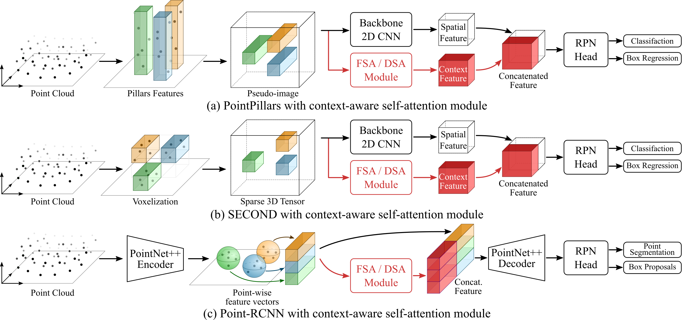
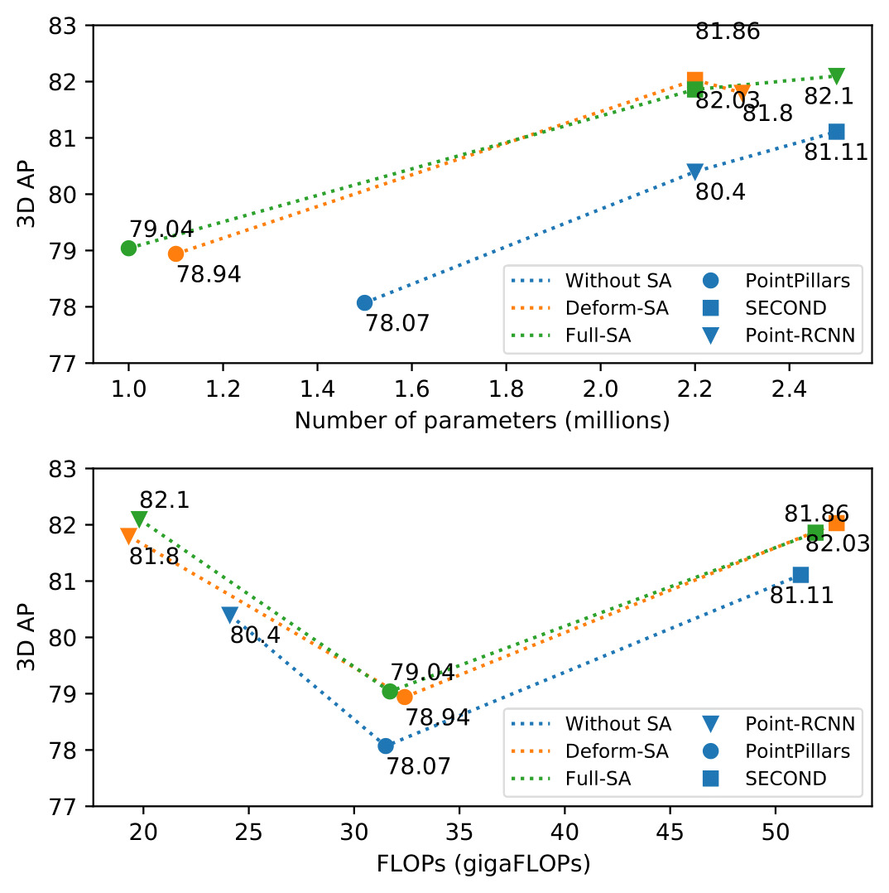
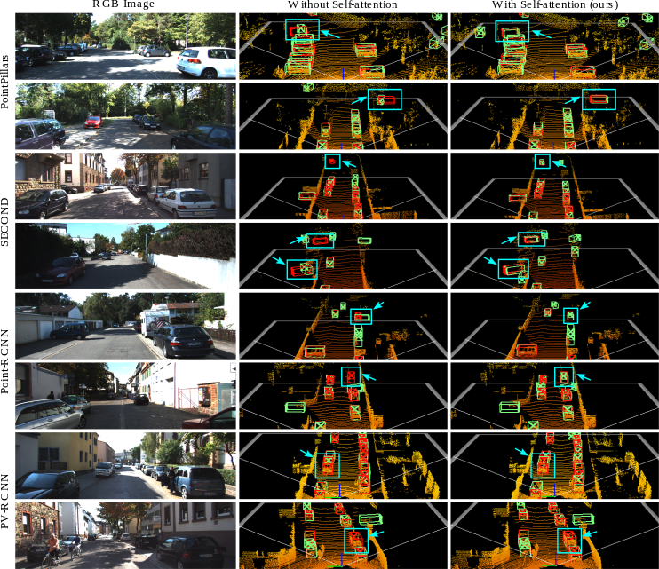

# SA-Det3D: Self-Attention Based Context-Aware 3D Object Detection

By [Prarthana Bhattacharyya](https://scholar.google.com/citations?user=v6pGkNQAAAAJ&hl=en), [Chengjie Huang](https://scholar.google.com/citations?user=O6gvGZgAAAAJ&hl=en) and [Krzysztof Czarnecki](https://scholar.google.com/citations?hl=en&user=ZzCpumQAAAAJ).

We provide code support and configuration files to reproduce the results in the paper:
Self-Attention Based Context-Aware 3D Object Detection. 
<br/> Our code is based on [OpenPCDet](https://github.com/open-mmlab/OpenPCDet), which is a clean open-sourced project for benchmarking 3D object detection methods. 


## Overview

<div align="center">
  
  <p>Fig.1. Self-Attention augmented global-context aware backbone networks. </p>
</div>

In this paper, we explore variations of 
self-attention for contextual modeling in 3D object 
detection by augmenting convolutional features with 
self-attention features. 
<br/>
We first incorporate the pairwise self-attention mechanism into the  current 
state-of-the-art BEV, voxel, point and point-voxel based detectors and show 
consistent improvement over strong baseline models while simultaneously 
significantly reducing their parameter footprint and computational cost. 
We call this variant *full self-attention* (*FSA*).
<br/>
We also propose a self-attention variant that 
samples a subset of the most representative features by 
learning deformations over randomly sampled locations.
This not only allows us to scale explicit global contextual 
modeling to larger point-clouds, 
but also leads to more discriminative and informative feature 
descriptors. We call this variant *deformable self-attention* (*DSA*).


## Results
- Self-attention (SA) systematically 
improves 3D object detection across  state-of-the-art  3D  detectors: PointPillars, SECOND and 
Point-RCNN. In this figure, we show 3D AP on moderate Car class of KITTI val split (R40) vs. the 
number of parameters (Top) and 
GFLOPs (Bottom) for baseline models and proposed baseline extensions with 
Deformable SA (DSA) and Full SA (FSA).
<div align="center">
  
  <p>Fig.2. 3D Car AP with respect to params and FLOPs of baseline and proposed 
self-attention variants. </p>
</div>
<br/>

- We also illustrate qualitative performance on KITTI val split. We show that our method 
identifies missed detections and removes false positives. Red bounding box 
represents ground truth and green represents detector outputs. 
From left to right: (a) RGB image of challenging scenes. 
(b) Result of the state-of-the-art methods: PointPillars, 
SECOND, Point-RCNN and PV-RCNN. (c) Result of our full self-attention (FSA) 
augmented baselines, which uses significantly fewer 
parameters and FLOPs.
<div align="center">
  
  <p>Fig.3. Visualizing qualitative results between baseline and
our proposed self-attention module.</p>
</div>

## Model Zoo
We provide our proposed detection models in this section. The 3D 
AP results (R-40) on KITTI 3D Object Detection validation of the 
Car moderate category are shown in the table below.

**Notes:**
- For inference, our models have been tested with 1 Tesla V-100 GPU and Pytorch 1.3.
- We use the checkpoints released by [OpenPCDet](https://github.com/open-mmlab/OpenPCDet) as our baseline for evaluation.
- Our models are trained with 4 Tesla V-100 GPUs and Pytorch 1.3.
<br/>

|                                                     | Car 3D AP | Params (M) | G-FLOPs | download | 
|-----------------------------------------------------|:-------:|:-------:|:-------:|:---------:|
| [PointPillar_baseline](https://github.com/open-mmlab/OpenPCDet/blob/master/tools/cfgs/kitti_models/pointpillar.yaml) | 78.39 | 4.8 | 63.4 | [PointPillar](https://drive.google.com/file/d/1tXU14qouG6EWo5QkjwP9KK22NSyWq1Bf/view?usp=sharing) |
| [PointPillar_red](configs/pointpillar_red.yaml) | 78.07 | 1.5 | 31.5 | [PointPillar-red](https://drive.google.com/file/d/1xQFhCEuiAWr8oLxL-xGYSqqCKVcrx9au/view?usp=sharing) |
| [PointPillar_DSA](configs/pointpillar_dsa.yaml) | 78.94 | 1.1 | 32.4 | [PointPillar-DSA](https://drive.google.com/file/d/1pPH5woN9IBQeWxdVdlcO03k3zRCtEjoJ/view?usp=sharing) |
| [PointPillar_FSA](configs/pointpillar_fsa.yaml) | **79.04** | 1.0 | 31.7 | [PointPillar-FSA](https://drive.google.com/file/d/1pVkS_zf7XMnwkWtyaxfgZ0a7_kF_ghmV/view?usp=sharing) |
| [SECOND_baseline](https://github.com/open-mmlab/OpenPCDet/blob/master/tools/cfgs/kitti_models/second.yaml) | 81.61 | 4.6 | 76.7 | [SECOND](https://drive.google.com/file/d/16N3zqCTk6j973XY26mdx2KwudsxRZ2r0/view?usp=sharing) |
| [SECOND_red](configs/second_red.yaml) | 81.11 | 2.5 | 51.2 | [SECOND-red](https://drive.google.com/file/d/1HhUtyWu8JVSDPImyAe2NBVyIqyroTEXG/view?usp=sharing) |
| [SECOND_DSA](configs/second_dsa.yaml) | **82.03** | 2.2 | 52.6 | [SECOND-DSA](https://drive.google.com/file/d/1lbgI5ZOB8WhMiTgK0vTw26pw_BdZ9J87/view?usp=sharing) |
| [SECOND_FSA](configs/second_fsa.yaml) | 81.86 | 2.2 | 51.9 | [SECOND-FSA](https://drive.google.com/file/d/1hyIBqFdql_FtEgavq6rEzUbIbPztQT7r/view?usp=sharing) |
| [Point-RCNN_baseline](https://github.com/open-mmlab/OpenPCDet/blob/master/tools/cfgs/kitti_models/pointrcnn_iou.yaml) | 80.52 | 4.0 | 27.4 | [Point-RCNN](https://drive.google.com/file/d/1Hab5lfwmqnRf928jIMJur5xt4PzspoOY/view?usp=sharing) |
| [Point-RCNN_red](configs/pointrcnn_red.yaml) | 80.40 | 2.2 | 24 | [Point-RCNN-red](https://drive.google.com/file/d/1jD-TzJwKYfEYzSVTmErU9AzO9d0uiCos/view?usp=sharing) |
| [Point-RCNN_DSA](configs/pointrcnn_dsa.yaml) | 81.80 | 2.3 | 19.3 | [Point-RCNN-DSA](https://drive.google.com/file/d/1buJs9bNwl0YzP7uLlEjdfkHcqbvVMKAN/view?usp=sharing) |
| [Point-RCNN_FSA](configs/pointrcnn_fsa.yaml) | **82.10** | 2.5 | 19.8 | [Point-RCNN-FSA](https://drive.google.com/file/d/1i_My1kHZNt6n5QAgO-AoiNRxjOwEG4R0/view?usp=sharing) |
| [PV-RCNN_baseline](https://github.com/open-mmlab/OpenPCDet/blob/master/tools/cfgs/kitti_models/pv_rcnn.yaml) | 84.83 | 12 | 89 | [PV-RCNN](https://drive.google.com/file/d/11twTR4wN0ZmEQE2Bh6Cb2gO7qc9z1b8p/view?usp=sharing) |
| [PV-RCNN_DSA](configs/pvrcnn_dsa.yaml) | 84.71 | 10 | 64 | [PV-RCNN-DSA](https://drive.google.com/file/d/1-iLeNQ4XdbN7ncVBuHXd-e-L3pwpoAyB/view?usp=sharing) |
| [PV-RCNN_FSA](configs/pvrcnn_fsa.yaml) | **84.95** | 10 | 64.3 | [PV-RCNN-FSA](https://drive.google.com/file/d/1hsy3nCO6Xk6cW3VP0SYLojhUpmqzYRab/view?usp=sharing) |


## Usage
a. Clone the repo:
```
git clone --recursive https://github.com/AutoVision-cloud/SA-Det3D
```
b. Copy SA-Det3D src into OpenPCDet: 
```
sh ./init.sh
```

c. Install OpenPCDet and prepare KITTI data:

Please refer to [INSTALL.md](docs/INSTALL.md) for installation and dataset preparation.

d. Run experiments with a specific configuration file:

Please refer to [GETTING_STARTED.md](docs/GETTING_STARTED.md) to learn more about how to train and run inference on this detector.

## Acknowledgement
* [second.pytorch](https://github.com/traveller59/second.pytorch)
* [PointRCNN](https://github.com/sshaoshuai/PointRCNN)
* [PV-RCNN](https://github.com/open-mmlab/OpenPCDet)
* [MLCVNet](https://github.com/NUAAXQ/MLCVNet)
